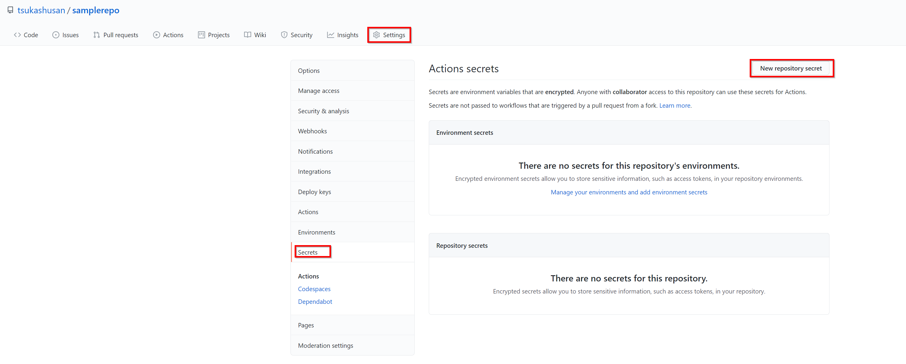
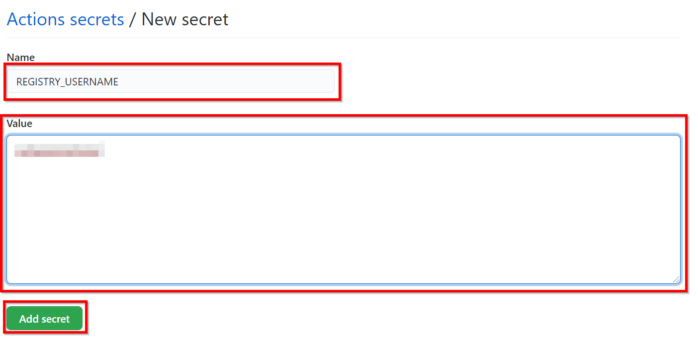
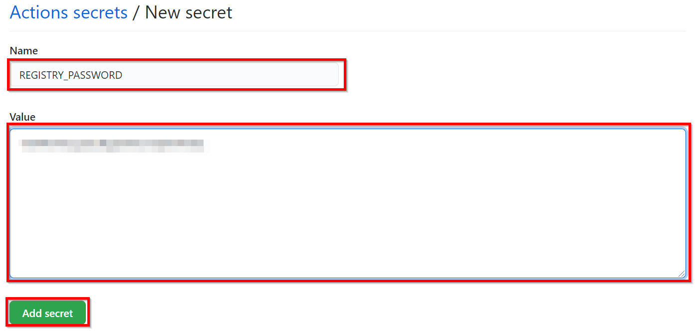
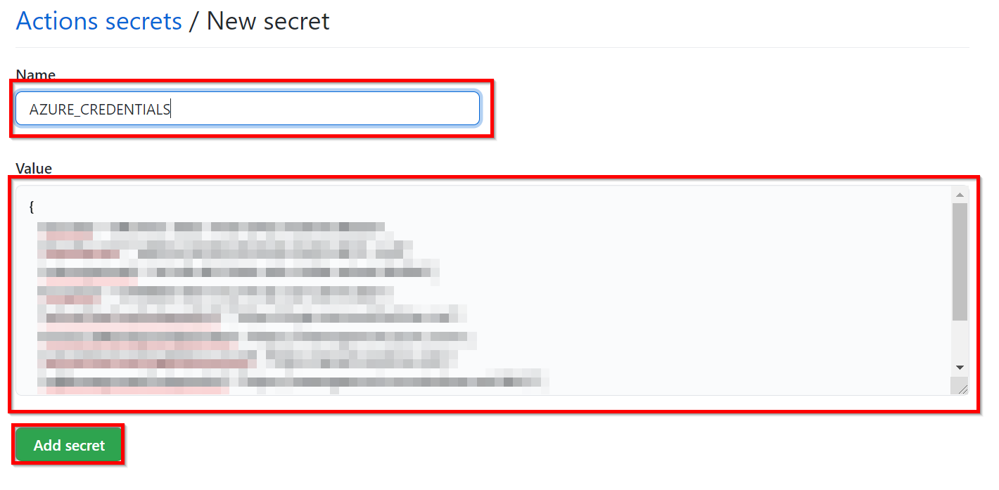

# Setting GitHub Actions

##  Service Principal
1. Replace Variable
- _xxx_ -> Service Principal Name
- _xxxxxxxx-xxxx-xxxx-xxxx-xxxxxxxxxxxx_ -> Subscription ID
- _xxxx_ -> Resource Group Name
- _xxxxx_ -> Application Name from Azure WebApps

```
$servicePrincipalName = "xxx"
$subscriptionId = "xxxxxxxx-xxxx-xxxx-xxxx-xxxxxxxxxxxx"
$resourceGroupName = "xxxx"
$appName = "xxxxx"
az ad sp create-for-rbac --name "${servicePrincipalName}" --sdk-auth --role contributor `
--scopes "/subscriptions/${subscriptionId}/resourceGroups/${resourceGroupName}/providers/Microsoft.Web/sites/${appName}"
```
or
```
$servicePrincipalName = "xxx"
$subscriptionId = "xxxxxxxx-xxxx-xxxx-xxxx-xxxxxxxxxxxx"
$resourceGroupName = "xxxx"
az ad sp create-for-rbac --name "${servicePrincipalName}" --sdk-auth --role contributor `
--scopes "/subscriptions/${subscriptionId}/resourceGroups/${resourceGroupName}"
```
Copy result of [az ad sp...]
```
{
  "clientId": "xxxxxxxx-xxxx-xxxx-xxxx-xxxxxxxxxxxx",
  "clientSecret": "xxxxx",
  "subscriptionId": "xxxxxxxx-xxxx-xxxx-xxxx-xxxxxxxxxxxx",
  "tenantId": "xxxxxxxx-xxxx-xxxx-xxxx-xxxxxxxxxxxx",
  "activeDirectoryEndpointUrl": "https://login.microsoftonline.com",
  "resourceManagerEndpointUrl": "https://management.azure.com/",
  "activeDirectoryGraphResourceId": "https://graph.windows.net/",
  "sqlManagementEndpointUrl": "https://management.core.windows.net:8443/",
  "galleryEndpointUrl": "https://gallery.azure.com/",
  "managementEndpointUrl": "https://management.core.windows.net/"
}
```

## Setting Actions
### Common Setting
#### Setting Repogitory Secret



1. REGISTRY_USERNAME -> Result of [az acr credential show ...]

1. REGISTRY_PASSWORD -> Result of [az acr credential show ...]

1. AZURE_CREDENTIALS -> Copy result of [az ad sp...]



#### Setting YAML(build.yml)
- xxx -> Azure Container Registry Name
- xxxx -> Container Image Name from Azure Container Registry

```
name: Linux Container Node Workflow for Build

on: [push]

jobs:
  build:
    runs-on: ubuntu-latest
    env:
      CONTAINER_REGISTRY_NAME: 'xxx'
      CONTAINER_IMAGE_NAME: 'xxxx'
    steps:
    - uses: actions/checkout@v2
    - uses: azure/docker-login@v1
      with:
        login-server: ${{ env.CONTAINER_REGISTRY_NAME }}.azurecr.io
        username: ${{ secrets.REGISTRY_USERNAME }}
        password: ${{ secrets.REGISTRY_PASSWORD }}
    - run: |
        docker build . -t ${{ env.CONTAINER_REGISTRY_NAME }}.azurecr.io/${{ env.CONTAINER_IMAGE_NAME }}:${{ github.sha }}
        docker push ${{ env.CONTAINER_REGISTRY_NAME }}.azurecr.io/${{ env.CONTAINER_IMAGE_NAME }}:${{ github.sha }}
```

#### Setting YAML(deply.yml)
- xxx -> Azure Container Registry Name
- xxxx -> Container Image Name from Azure Container Registry
- xxxxx -> Application Name from Azure WebApps
```
name: Linux Container Node Workflow for Deploy

on: [push]

jobs:
  build:
    runs-on: ubuntu-latest
    env:
      CONTAINER_REGISTRY_NAME: 'xxx'
      CONTAINER_IMAGE_NAME: 'xxxx'
      APP_NAME: 'xxxxx'
    steps:
    - uses: actions/checkout@v2
    - uses: azure/docker-login@v1
      with:
        login-server: ${{ env.CONTAINER_REGISTRY_NAME }}.azurecr.io
        username: ${{ secrets.REGISTRY_USERNAME }}
        password: ${{ secrets.REGISTRY_PASSWORD }}

    - run: |
        docker build . -t ${{ env.CONTAINER_REGISTRY_NAME }}.azurecr.io/${{ env.CONTAINER_IMAGE_NAME }}:${{ github.sha }}
        docker push ${{ env.CONTAINER_REGISTRY_NAME }}.azurecr.io/${{ env.CONTAINER_IMAGE_NAME }}:${{ github.sha }}   
    - name: Azure Login
      uses: azure/actions/login@v1
      with:
          creds: ${{ secrets.AZURE_CREDENTIALS }} 
    - name: Set Web App ACR authentication
      uses: Azure/appservice-settings@v1
      with:
       app-name: ${{ env.APP_NAME }}
       app-settings-json: |
         [
             {
                 "name": "DOCKER_REGISTRY_SERVER_PASSWORD",
                 "value": "${{ secrets.REGISTRY_PASSWORD }}",
                 "slotSetting": false
             },
             {
                 "name": "DOCKER_REGISTRY_SERVER_URL",
                 "value": "https://${{ env.CONTAINER_REGISTRY_NAME }}.azurecr.io",
                 "slotSetting": false
             },
             {
                 "name": "DOCKER_REGISTRY_SERVER_USERNAME",
                 "value": "${{ secrets.REGISTRY_USERNAME  }}",
                 "slotSetting": false
             }
         ]
    - uses: azure/webapps-deploy@v2
      with:
        app-name: ${{ env.APP_NAME }}
        # publish-profile: ${{ secrets.AZURE_WEBAPP_PUBLISH_PROFILE }}
        images: '${{ env.CONTAINER_REGISTRY_NAME }}.azurecr.io/${{ env.CONTAINER_IMAGE_NAME }}:${{ github.sha }}'
# Azure logout 
    - name: logout
      run: |
            az logout

```